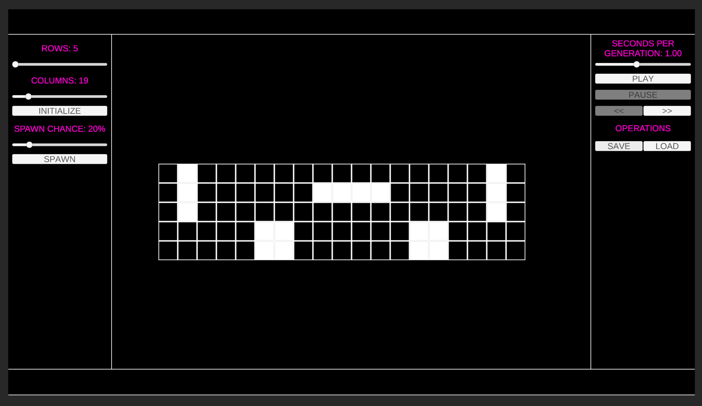

# Conway's Game of Life

Implementation as part of GP24

Supports:
* Variable grid size (5x5 - 100x100)
* Random spawning of live cells (by percentage)
* Custom cell patterns (click in grid to toggle state)
* Pan, zoom, rotate
* Load/save functionality
* Detection of repeating patterns (stable state)

